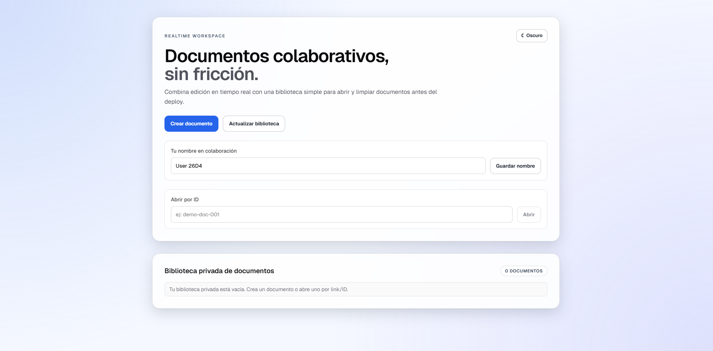

# Collaborative Editor
<p align="center">
  
</p>

Editor colaborativo en tiempo real para portafolio, construido con Next.js + TipTap + Yjs + WebSocket.

## Idea

Crear una experiencia tipo documento compartido donde varias personas puedan editar el mismo contenido en simultáneo, ver presencia de usuarios y compartir por link.

## Capacidades actuales

- Edición colaborativa en tiempo real (bidireccional).
- Cursores/presencia de usuarios conectados.
- Indicador de typing por usuario.
- Historial de cambios con vista resumida + página completa.
- Creación, apertura y borrado de documentos desde UI.
- Regla de ownership: solo el creador puede borrar.
- Biblioteca privada por navegador (solo documentos conocidos por el usuario).
- Persistencia de documentos en backend realtime.
- Límite de creación de documentos por usuario.
- Tema claro/oscuro.

## Stack

- Frontend: Next.js (App Router), React, TypeScript, Tailwind.
- Editor: TipTap.
- Realtime: Yjs + y-websocket protocol.
- Backend realtime: Node.js + ws.
- Deploy objetivo: Vercel (frontend) + Railway (backend realtime).

## Quickstart

Requisitos:
- Node.js 22+
- pnpm 10+

Instalar:

```bash
pnpm install
```

Configurar variables:

```bash
cp .env.example .env.local
```

Levantar en local (2 terminales):

```bash
pnpm dev:ws
pnpm dev
```

Abrir `http://localhost:3000` y probar un documento en dos pestañas.

## Variables relevantes

Frontend:
- `NEXT_PUBLIC_WS_URL` (ej: `ws://localhost:1234` o `wss://<backend>`)
- `NEXT_PUBLIC_WS_HTTP_URL` (ej: `http://localhost:1234` o `https://<backend>`)

Backend realtime:
- `HOST`
- `WS_PORT`
- `WS_CORS_ORIGIN`
- `WS_PERSISTENCE_DIR`
- `WS_MAX_DOCS_PER_OWNER`
- `WS_MAX_CONNECTIONS`
- `WS_MAX_CONNECTIONS_PER_DOC`
- `WS_MAX_ACTIVE_DOCS`
- `WS_MEMORY_SOFT_LIMIT_MB`

Referencia completa: `.env.example`.

## Scripts

- `pnpm dev`: frontend
- `pnpm dev:ws`: websocket server (dev)
- `pnpm build`: build frontend
- `pnpm start`: frontend build
- `pnpm start:ws`: websocket server (runtime)
- `pnpm lint`: lint

## Deploy (resumen)

- Frontend (Vercel): configurar `NEXT_PUBLIC_WS_URL` y `NEXT_PUBLIC_WS_HTTP_URL`.
- Backend (Railway): usar `Dockerfile.ws` + volumen persistente en `/data`.

Guía completa: `Docs/DEPLOY_RUNBOOK.md`.

## Documentación útil

- `Docs/ROADMAP_FASES_PRS.md`
- `Docs/ARCHIVOS_ACTUALES_DETALLADO.md`
- `Docs/DEPLOY_RUNBOOK.md`
